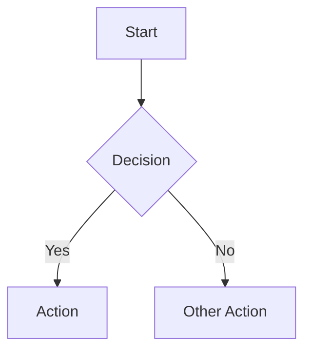
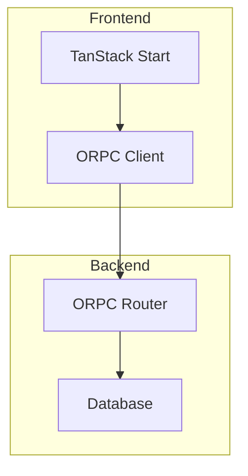
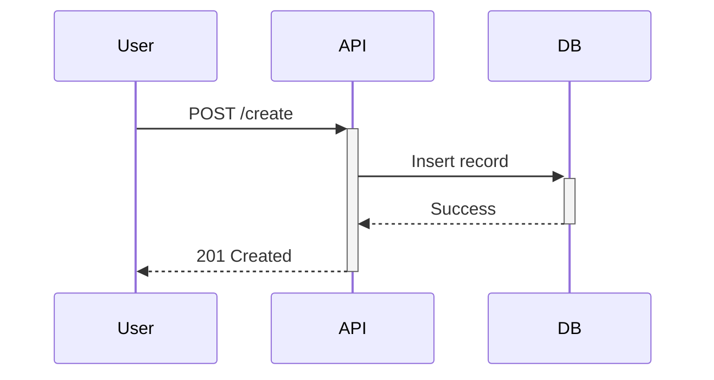

# Native UI Components Reference

Claude Code provides several native UI components for rich user interaction. Use these consistently across all skills and commands.

## 1. AskUserQuestion Tool

Use for **all user choices** instead of plain text numbered options.

### Pattern

```yaml
AskUserQuestion:
  header: "Short Label"           # Max 12 chars, displayed as chip/tag
  question: "Full question?"      # Clear, ends with ?
  options:                        # 2-4 options required
    - label: "Option A"           # Concise 1-5 words
      description: "What this does"
    - label: "Option B"
      description: "Alternative choice"
  multiSelect: false              # true if multiple can be selected
```

### When to Use

- Task type selection in `<intake>` sections
- Approval requests (apply changes, commit, etc.)
- Next step choices after completing a phase
- Any decision point in a workflow

### Example

```yaml
AskUserQuestion:
  header: "Apply"
  question: "Should I apply these changes?"
  options:
    - label: "Apply and commit"
      description: "Apply all changes and create a git commit"
    - label: "Apply only"
      description: "Apply changes but don't commit (review first)"
    - label: "Cancel"
      description: "Don't make any changes"
  multiSelect: false
```

## 2. TodoWrite Tool

Use for **all multi-step workflows** to show progress.

### Pattern

```yaml
TodoWrite:
  todos:
    - content: "Task description (imperative)"
      status: "pending|in_progress|completed"
      activeForm: "Task description (present continuous)"
```

### When to Use

- Complex multi-step tasks (3+ distinct steps)
- User provides multiple tasks
- Non-trivial tasks requiring planning
- After receiving new instructions
- When starting/completing tasks

### Best Practices

- Only ONE task should be `in_progress` at a time
- Mark tasks `completed` IMMEDIATELY after finishing
- Update status in real-time as you work
- Include both `content` (imperative: "Run tests") and `activeForm` (continuous: "Running tests")

### Example

```yaml
TodoWrite:
  todos:
    - content: "Analyze PR review comments"
      status: "completed"
      activeForm: "Analyzing PR review comments"
    - content: "Fix SQL injection vulnerability"
      status: "in_progress"
      activeForm: "Fixing SQL injection vulnerability"
    - content: "Update tests"
      status: "pending"
      activeForm: "Updating tests"
```

## 3. Mermaid Diagrams

Use for **visual architecture and flow documentation**.

### Pattern

````markdown

````

### When to Use

- Planning workflows - show component relationships
- Review workflows - show data flow
- Architecture documentation
- State machine visualization
- Dependency graphs

### Diagram Types

| Type | Use Case |
|------|----------|
| `graph TD` | Top-down flow charts |
| `graph LR` | Left-right flow charts |
| `sequenceDiagram` | API/interaction sequences |
| `erDiagram` | Database/entity relationships |
| `stateDiagram-v2` | State machines |
| `classDiagram` | Class/type relationships |

### Example - Architecture

````markdown

````

### Example - Sequence

````markdown

````

## 4. Rich Markdown Output

Use consistent formatting for all outputs.

### Code Blocks

Always include language hints:
````markdown
```typescript
const example = "code";
```
````

### Tables

Use for structured data:
```markdown
| Column A | Column B |
|----------|----------|
| Value 1  | Value 2  |
```

### Callouts

Use for important notices:
```markdown
> **Note:** Important information

> **Warning:** Caution required

> **Critical:** Must not ignore
```

## 5. Progress Indicators

For long-running operations, provide status updates.

### Pattern

```markdown
Phase 1 of 3: Analyzing...
Phase 2 of 3: Processing...
Phase 3 of 3: Completing...
```

### With Checkmarks

```markdown
- [x] Step 1 completed
- [x] Step 2 completed
- [ ] Step 3 in progress
- [ ] Step 4 pending
```

## 6. Custom Output Styles

Create consistent, recognizable output patterns for each skill.

### Skill Header Pattern

Start major outputs with a distinctive header:

```markdown
## 🔧 [Skill Name] - [Action]

**Context:** [Brief context or target]
**Status:** [Current phase]
```

### Severity-Based Styling

Use consistent symbols and colors for findings:

| Level | Symbol | Usage |
|-------|--------|-------|
| Critical | 🔴 | Security issues, blockers |
| Important | 🟡 | Should fix, significant concerns |
| Info | 🔵 | Nice-to-have, suggestions |
| Success | ✅ | Completed, passed |
| Warning | ⚠️ | Caution needed |
| Error | ❌ | Failed, blocked |

### Summary Blocks

End workflows with structured summaries:

```markdown
## ✅ [Workflow Name] Complete

**Target:** [What was processed]
**Duration:** [Time taken or steps completed]

### Results
- ✅ [Positive outcome 1]
- ✅ [Positive outcome 2]
- ⚠️ [Warning or note]

### Next Steps
[AskUserQuestion for options...]
```

### Finding Reports

Structure findings consistently:

```markdown
### 🔴 [Finding Title]

**Location:** `file/path:line`
**Severity:** Critical | Important | Info
**Category:** Security | Performance | Quality

**Issue:** [Description of the problem]

**Recommendation:** [How to fix]

**Example:**
```code
// Before
[problematic code]

// After
[fixed code]
```
```

### File References

Always include clickable file references:

```markdown
- `src/components/Button.tsx:42` - Button click handler
- `lib/utils/validate.ts:15-28` - Validation logic
```

## Integration Checklist

When creating/updating skills and commands:

- [ ] Replace all numbered option lists with `AskUserQuestion`
- [ ] Add `TodoWrite` for multi-step workflows
- [ ] Include Mermaid diagrams for architecture visualization
- [ ] Use consistent Markdown formatting
- [ ] Provide progress indicators for long operations
- [ ] Use severity symbols consistently (🔴🟡🔵)
- [ ] Include structured summary blocks
- [ ] Add clickable file references with line numbers
