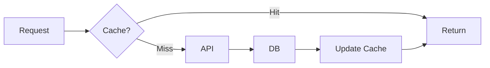

<pr_info>
!`${CLAUDE_PLUGIN_ROOT}/scripts/git/gh-pr-info.sh 2>&1`
</pr_info>

<stack_context>
!`${CLAUDE_PLUGIN_ROOT}/scripts/git/machete-context.sh 2>&1`
</stack_context>

<notes>
Writing style per @rules/writing-style.md. Machete markers per @rules/machete-workflow.md.
</notes>

<process>

<phase name="validate">
If no PR found:
```
No PR found for current branch.
```
Exit - nothing to update.
</phase>

<phase name="gather-context">
Analyze what changed since PR was created or last updated:

```bash
# Get base branch
BASE=$(gh pr view --json baseRefName -q '.baseRefName')

# Get commit summary since base
git log origin/${BASE}..HEAD --pretty=format:"%s" | head -20

# Check if plan file exists
ls .claude/plans/*.md 2>/dev/null
```

</phase>

<phase name="generate-title">
Generate PR title from commits:

- **Single commit**: Use commit message as title
- **Multiple commits**: `type(scope): summary of changes`
- **Mixed types**: Use most significant (feat > fix > refactor > docs > chore)

```bash
# Get primary commit type
PRIMARY_TYPE=$(git log origin/${BASE}..HEAD --pretty=format:"%s" | head -1 | cut -d'(' -f1)
```

</phase>

<phase name="generate-body">
Generate PR body based on template selection:

| Commit Type          | Template                                               |
| -------------------- | ------------------------------------------------------ |
| `feat`               | `skills/git/templates/pr-feature.md` - Full template   |
| `fix`                | `skills/git/templates/pr-fix.md` - Bug fix template    |
| `refactor/docs/test` | `skills/git/templates/pr-refactor.md` - Light template |
| Mixed/other          | `skills/git/templates/pr-default.md` - Minimal         |

Sources for content:

- **Summary**: From commit messages
- **Why**: From plan file (if exists) or commit bodies
- **What changed**: From `git diff --stat`
- **How to test**: From plan's test criteria or generate from changes

</phase>

<phase name="add-visuals">
**Add diagrams when they help reviewer understanding:**

Use ASCII art for simple flows:

```
Before:  Client → API → DB
After:   Client → Cache → API → DB
                   ↓
                 (miss)
```

Use Mermaid for complex architecture/flows:



**When to add visuals:**

- Data flow changes
- New component relationships
- State machine modifications
- Before/after comparisons
- Complex conditional logic

**Keep it simple** - ASCII for quick concepts, Mermaid only when complexity warrants it.

</phase>

<phase name="update-pr">

Update PR title:

```bash
PR_NUM=$(gh pr view --json number -q '.number')
gh pr edit $PR_NUM --title "type(scope): description"
```

Update PR body (preserve machete markers if present):

```bash
gh pr edit $PR_NUM --body "$(cat <<'EOF'
[Generated PR body]
EOF
)"
```

</phase>

<phase name="update-machete">
**ALWAYS run if `<stack_context>` shows branch is in machete layout:**

Check the `<stack_context>` output above. If it shows "is in machete layout", run these commands:

```bash
# Check if machete-managed (skip if not)
if git machete is-managed "$(git branch --show-current)" 2>/dev/null; then
  # Ensure config is set for full PR description intro (required for --related)
  git config machete.github.prDescriptionIntroStyle full

  # Update PR annotations with stack info
  git machete github anno-prs

  # Update all related PRs in the stack (parents and children)
  git machete github update-pr-descriptions --related
fi
```

**This step is CRITICAL** - it ensures all stacked PRs show the correct dependency chain.

</phase>

</process>

<success_criteria>

- [ ] PR title reflects commit type and scope
- [ ] PR body generated from template
- [ ] Plan context included (if exists)
- [ ] Visuals added where beneficial (ASCII/Mermaid)
- [ ] Machete markers preserved
- [ ] Stack annotations updated (if machete-managed)

</success_criteria>
